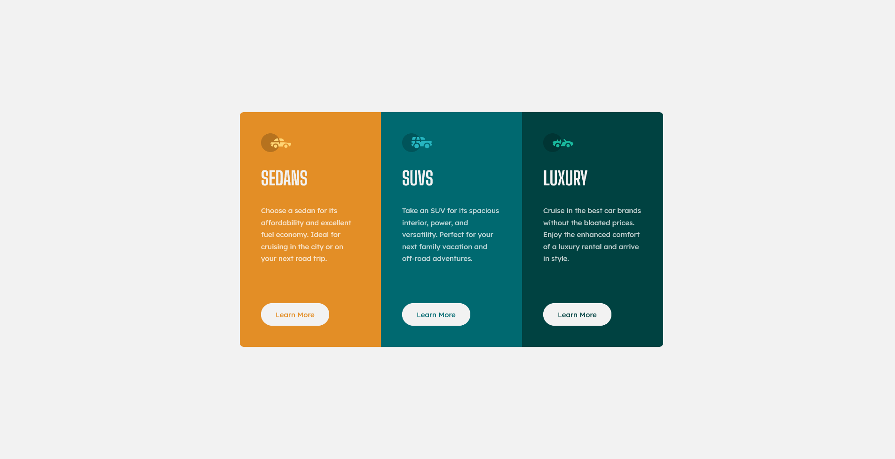
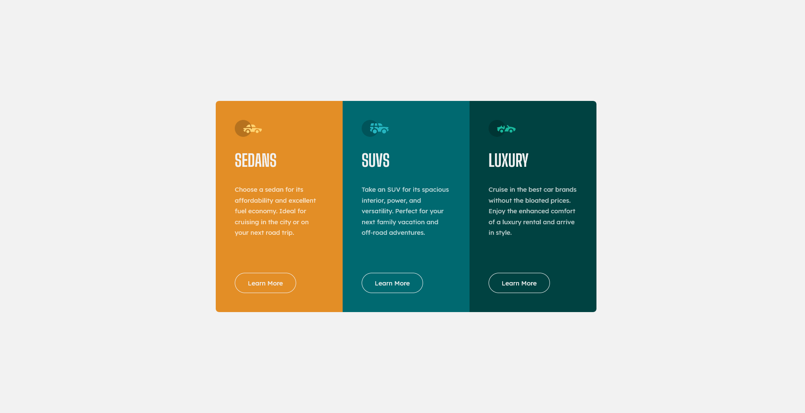

# Frontend Mentor - 3-column preview card component solution

This is a solution to the [3-column preview card component challenge on Frontend Mentor](https://www.frontendmentor.io/challenges/3column-preview-card-component-pH92eAR2-).

## Overview

### The challenge

Users should be able to:

- View the optimal layout depending on their device's screen size
- See hover states for interactive elements

### Screenshot

**Normal**

**Hover**

### Links

- [My solution](https://www.frontendmentor.io/solutions/responsive-3-column-preview-card-component-using-css-flexbox-WPENPvvIv)
- [Live site](https://aphilip97.github.io/3-column-preview-card-component/)

## My process

### Built with

- Semantic HTML5 markup
- CSS custom properties
- Flexbox
- Media queries
- Mobile-first workflow

### What I learned

I hadn't finished any attempted implementation of anything responsive before, so by seeing this challenge through to completion, I learned how to use the different layout tools in CSS at the right time and in the right amounts.

My previous failed attempts at implementing websites to be responsive were fraught with frustration at the number of different ways in which I could achieve the desired outcome. I was always second guessing myself thinking that I had overengineered it by using CSS Grid.

I needed to build something using media queries and maybe a little bit of flexbox as I came to understand that CSS Grid is best used for the overall layout rather than smaller components. All the different grids became difficult to manage when I tried to build example projects for my portfolio.

This component was just complex enough to let me learn a few things:

- How to implement the design mobile first using `min-width` media queries.
- That it is better to use flexbox to align the "Learn More" buttons vertically at the bottom of the column instead of using `position: absolute;`. If the buttons are positioned absolutely they will overlap the text above them if the height is too small.
- That I can hide headings whilst still making them visible to screen readers.

### Continued development

I would like to continue learning about accessibility as that is an area that I am not particularly strong at that is also becoming required in websites more and more.

I would like to learn about fluid typography as content begins to wrap on smaller screen sizes and it goes too far sometimes.

### Useful resources

- [Flexbox guide from CSS-TRICKS](https://css-tricks.com/snippets/css/a-guide-to-flexbox/) - This helped me figure out which flexbox properties I needed to use and when to use them. It is a great birds-eye view reference of everything you can do with CSS flexbox.
- [Places it's tempting to use `display: none;` but don't](https://css-tricks.com/places-its-tempting-to-use-display-none-but-dont/) - This post from CSS-TRICKS let me know that the way I had gone about hiding the heading elements, needed to pass the automated accessibility checks performed on my submission to frontendmentor.io, was wrong.
- [All page content must be contained by landmarks](https://dequeuniversity.com/rules/axe/4.2/region?application=axeAPI) - This page from [dequeuniversity.com](dequeuniversity.com) helped me realize what it was that I was doing wrong with regards to containing all content on a page within landmark elements or ARIA landmark regions.

## Author

- Website - [Athul Philip](https://aphilip97.github.io)
- Frontend Mentor - [@aphilip97](https://www.frontendmentor.io/profile/aphilip97)
